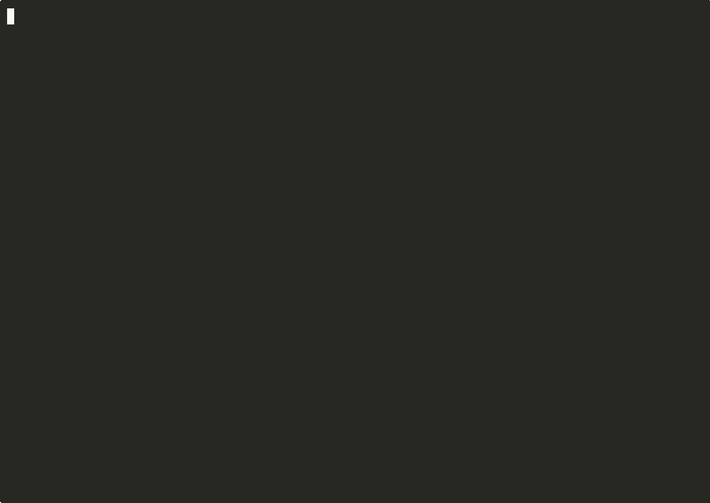

# synthguard

Open screening gateway for DNA synthesis orders. **DETECTION ONLY.** This
repository never generates, completes, optimizes, or suggests sequence
modifications. There is no generative component.

[](https://github.com/techiegoku2623/synthguard/actions/workflows/ci.yml)
[](pyproject.toml)
[](LICENSE)




Regenerable terminal video: `make record`. [Full mp4](demo/out/synthguard-demo.mp4). Per-shot loops live in `demo/out/`. See `demo/README.md`.

## Status

| Phase | Deliverable | Status |
| --- | --- | --- |
| 0 | Research memo and harnesses | Phase 0–3 Merged |
| 1 | Architecture, schemas, data contracts | Phase 0–3 Merged |
| 2 | First vertical slice | Phase 0–3 Merged |
| 3 | Evaluation and demo | Phase 0–3 Merged |

Status values: Not started / In progress / In review / Merged.

## The problem this solves

Synthesis providers need an auditable screen whose false-positive rate on
ordinary lab DNA is a public number. Closed vendor pipelines do not publish
that number, and an open tool that "helps" by rewriting a query so it would
clear is a different product — one this repo refuses to become.

This slice screens committed **benign** sequences only. It does not bundle
BLAST databases of regulated agents. It does not commit, construct, or
reference hazardous sequences.

See `CONTRIBUTING.md` and `docs/THREAT-MODEL.md`. Detection only.

## Walkthrough

`make demo` is the full walkthrough. No credentials. Under five minutes.
It screens the plasmid (clear), the near-miss (explain, not escalated), the
too-short refusal (exit 1, does not clear), the R001 split-order graph, and
the benign FP/FN tradeoff.

### Step 1 — screen and clear

```bash
make setup && synthguard screen --fasta data/sample/plasmid.fa
```

Actual stdout:

```
synthguard screen
DETECTION ONLY. No sequence generation or modification.
query: plasmid-backbone-fragment
query_hash: 25a6ed86956cffb700d1c068d9378588b32eb3ab46708785f59d0e6ebfe64e71
status: CLEAR  tier: auto-clear  exit: 0
length: 180  min_length: 50  identity: 1.000  threshold: 0.900
hit: plasmid_backbone_puc_style  identity=1.000  jaccard=1.000
rules:
  - R1 min-length gate (50 nt default)
  - R2 local identity vs committed benign panel
  - R2 hit plasmid_backbone_puc_style identity=1.000
  - R3 known-benign-backbone (identity ≥ 0.95) → auto-clear
decision log:
  measured_length=180 min_length=50
  query_hash=25a6ed86956cffb700d1c068d9378588b32eb3ab46708785f59d0e6ebfe64e71
  best_hit=plasmid_backbone_puc_style identity=1.000 threshold=0.900
  annotation=known-benign-backbone status=CLEAR
  detection_only: no sequence is generated or modified
Reviewer queue: empty (auto-clear).
  note: Detection only. No sequence modification is suggested.
  note: Max identity vs benign reference: 1.000 (threshold 0.900).
  note: Exact/near-exact match to the committed plasmid backbone fixture. CLEAR.
CLEAR: yes
Detection only. This tool does not generate, complete, optimize, or suggest
sequence modifications. Benign public sequences only.
```

### Step 2 — near-miss, not escalated

```bash
synthguard screen --fasta data/sample/near-miss.fa --explain
```

Actual stdout:

```
synthguard screen
DETECTION ONLY. No sequence generation or modification.
query: benign-homolog-near-miss
query_hash: 258836f152688ace8abf0989c223de2a092981d82b1eb1ac2afd0b6aca6cf8d4
status: CLEAR  tier: auto-clear  exit: 0
length: 141  min_length: 50  identity: 0.851  threshold: 0.900
hit: ecoli_gapa_like_housekeeping  identity=0.851  jaccard=0.167
rules:
  - R1 min-length gate (50 nt default)
  - R2 local identity vs committed benign panel
  - R2 hit ecoli_gapa_like_housekeeping identity=0.851
  - R4 near-miss: identity below threshold 0.90 → do not escalate
decision log:
  measured_length=141 min_length=50
  query_hash=258836f152688ace8abf0989c223de2a092981d82b1eb1ac2afd0b6aca6cf8d4
  best_hit=ecoli_gapa_like_housekeeping identity=0.851 threshold=0.900
  why_not_escalated: identity 0.851 < threshold 0.900
  annotation=near-miss-benign-homolog status=CLEAR
  detection_only: no sequence is generated or modified
explain
  hit: ecoli_gapa_like_housekeeping
  rule: near-miss-benign-homolog
  why not escalated: identity 0.851 < threshold 0.900
  threshold vs identity: 0.900 vs 0.851
Reviewer queue: empty (auto-clear).
  note: Detection only. No sequence modification is suggested.
  note: Max identity vs benign reference: 0.851 (threshold 0.900).
  note: High homology to a benign relative. Must not auto-flag.
CLEAR: yes
Detection only. This tool does not generate, complete, optimize, or suggest
sequence modifications. Benign public sequences only.
```

### Step 3 — too short (does not clear)

```bash
synthguard screen --fasta data/sample/too-short.fa
```

Actual stdout (exit 1):

```
synthguard screen
DETECTION ONLY. No sequence generation or modification.
query: below-min-length
query_hash: e7c7a8d60d74cbce8c9f872a8dd222fe349fb695c93b61f00bf3e03b472243a7
status: NOT_SCREENABLE  tier: not-screenable  exit: 1
length: 20  min_length: 50  identity: 0.000  threshold: 0.900
hit: none
rules:
  - R1 min-length gate (50 nt default)
  - R1 fired: measured length below minimum → NOT SCREENABLE
decision log:
  measured_length=20 min_length=50
  query_hash=e7c7a8d60d74cbce8c9f872a8dd222fe349fb695c93b61f00bf3e03b472243a7
  gate=NOT_SCREENABLE (does not clear)
NOT SCREENABLE — this query does NOT clear.
             Reviewer queue (above auto-clear)
┏━━━━━━━━━━━━━━━━━━┳━━━━━━━━━━━━━━━━┳━━━━━━━━━━━━━━━━━━━━━━┓
┃ query            ┃ tier           ┃ reason               ┃
┡━━━━━━━━━━━━━━━━━━╇━━━━━━━━━━━━━━━━╇━━━━━━━━━━━━━━━━━━━━━━┩
│ below-min-length │ not-screenable │ measured 20 < min 50 │
└──────────────────┴────────────────┴──────────────────────┘
  note: Length 20 is below minimum screenable length 50.
CLEAR: no
Detection only. This tool does not generate, complete, optimize, or suggest
sequence modifications. Benign public sequences only.
```

### Step 4 — split-order graph, then the tradeoff

```bash
synthguard orders ingest data/sample/split-orders/
synthguard orders analyze --requester R001
make eval
```

Actual stdout from ingest + analyze:

```
synthguard orders ingest
directory: data/sample/split-orders
fragments: 5  store: /agent/repos/synthguard/data/local/orders.json
  R001-frag1  requester=R001  length=80
  R001-frag2  requester=R001  length=80
  R001-frag3  requester=R001  length=80
  R001-frag4  requester=R001  length=80
  R001-frag5  requester=R001  length=80
Detection only. Ingest stores fragments; it does not emit a gene.
Detection only. This tool does not generate, complete, optimize, or suggest
sequence modifications. Benign public sequences only.
synthguard orders analyze
requester: R001
detected=True  fragments=5  edges=7  reconstructed_fraction=1.000
notes: Overlapping fragments reconstruct a committed benign parent.
              Reviewer queue (graph reassembly)
┏━━━━━━━━━━━┳━━━━━━━━━━━━┳━━━━━━━━━━━┳━━━━━━━┳━━━━━━━━━━━━━━━┓
┃ requester ┃ flag       ┃ fragments ┃ edges ┃ reconstructed ┃
┡━━━━━━━━━━━╇━━━━━━━━━━━━╇━━━━━━━━━━━╇━━━━━━━╇━━━━━━━━━━━━━━━┩
│ R001      │ REASSEMBLY │ 5         │ 7     │ 1.000         │
└───────────┴────────────┴───────────┴───────┴───────────────┘
Graph reassembly flag: overlapping tiles from one requester. The parent sequence
is not emitted.
```

`make eval` re-runs the Phase 0 harnesses and prints the live tradeoff.
Actual `synthguard eval` stdout:

```
synthguard eval — FP/FN tradeoff (benign corpus)
DETECTION ONLY. FN / TPR against sequences of concern is unmeasured.
n=220  default_threshold=0.90  latency=0.212s for full corpus screen

threshold  flagged  n    FPR    FN
0.70       40      220  0.182  unmeasured
0.75       18      220  0.082  unmeasured
0.80       0       220  0.000  unmeasured
0.85       0       220  0.000  unmeasured
0.90       0       220  0.000  unmeasured
0.95       0       220  0.000  unmeasured
0.99       0       220  0.000  unmeasured

SOC TPR is structurally unmeasured: this repository does not commit hazardous
sequences.
```

Latency on this run was 0.212s for 220 sequences. FN against sequences of
concern is unmeasured on purpose.

POST `/screen` is implemented as `synthguard.api.screen_payload` for
callers that want a JSON body. The demo does not start a server.

Recordings: `demo/01-screen-and-clear.cast`, `demo/02-unscreenable.cast`,
`demo/03-split-order-graph.cast`, `demo/04-tradeoff-curve.cast`.

## Layout

Read in this order:

1. `docs/phase-0/research-memo.md` — why the defaults and the failure condition
2. `docs/THREAT-MODEL.md` — what this catches and what it structurally cannot
3. `CONTRIBUTING.md` — detection only; no generative component
4. `data/sample/README.md` — why each demo record exists
5. `src/synthguard/screen.py` — min-length + homology, no rewriter
6. `src/synthguard/split_order.py` — overlap graph
7. `src/synthguard/orders.py` — ingest / analyze
8. `research/phase0/` — the three measurements behind the memo
9. `src/synthguard/cli.py` — screen / orders / eval

## Results

Regenerated by `make eval`. Baseline column is mandatory.

<!-- EVAL_TABLE_BEGIN -->

| System | Metric | n | Notes |
| --- | --- | --- | --- |
| Identity ≥ 0.90 (Phase 0 default) | FPR 0.000 | 220 | Benign panel as stand-in hit list |
| Recommended threshold 0.80 | FPR 0.000 | 220 | Lowest T with FPR ≤ 0.05 |
| Local homology backend | faster=indexed | grid | BLAST/DIAMOND/HMM deferred; RTT unmeasured |
| Split-order graph | R001 detected=True | 4 requesters | control FP 0/3 |
| SOC TPR | unmeasured | — | No hazard sequences committed |

<!-- EVAL_TABLE_END -->

## 🏗️ Architecture & Event Topology

```mermaid
flowchart LR
    fasta[FASTA query] --> len[min-length gate]
    len -->|below 50 nt| refuse[NOT SCREENABLE exit 1]
    len -->|ok| hom[k-mer plus identity vs benign panel]
    hom --> result[ScreenResult CLEAR plus hash]
    orders[multi-order fragments] --> graph[overlap graph]
    graph --> split[SplitDetection reviewer queue]
```

`ScreenResult.would_flag_at_threshold` is a counterfactual for the FPR
harness. The sample path never auto-flags a known benign backbone.
`SplitDetection` reports overlap. It does not emit a reconstructed gene.

## ⚖️ Architecture Trade-offs & Pragmatic Decisions

| Chosen | Given up | What would change the answer |
| --- | --- | --- |
| Local k-mer + identity | BLAST / DIAMOND / HMM | A licensed SOC set plus a latency grid that loses |
| Benign-only reference | Bundled hazard DB | Nothing in git. SOC attach is later and external |
| Detection, never rewrite | "Helpful" sequence completer | Nothing. This is non-negotiable |
| Overlap graph, no assembler | de Bruijn reconstruction | A reviewer asking for the parent sequence as output — refuse |
| 50 nt minimum | Screening 20-mers | A measured oligo-scale backend with its own FPR |

## 🛡️ Edge Cases & Failure Modes

- `too-short.fa` (20 nt): NOT SCREENABLE, exit 1, does not clear.
- `near-miss.fa`: identity 0.851 is below the 0.90 default. Auto-flag is a bug.
- `plasmid.fa`: identity 1.0 to the committed backbone. CLEAR, not a hazard hit.
- Five R001 tiles: detected. Unrelated multi-order customers must not be.
- N bases and non-ACGT characters are stripped by the FASTA reader.
- Attaching a SOC database is out of scope; TPR is **unmeasured**.

## Limitations

This is not a licensed select-agent screen. The backend scores designed
benign fixtures. No BLAST database is shipped. No sequence is generated.
See `docs/THREAT-MODEL.md`.

## License and citation

MIT. Cite this repository for the detection gateway. Do not cite it as a
sequence design tool. See `CONTRIBUTING.md`.
